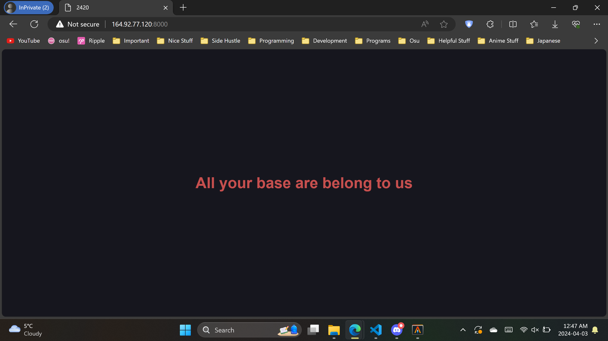
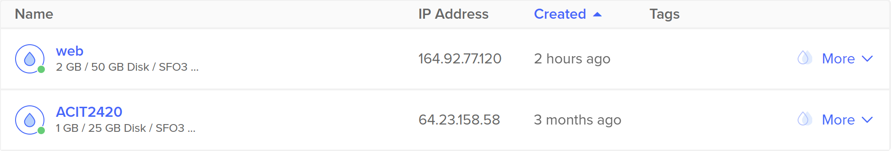

# Assignment 3 Part 1 - ACIT 2420 - Kevin Ding

This tutorial is meant for fresh installations of Arch Linux as a regular user. Ensure you have the IP address to your server for testing purposes.

### Step 1: Install Necessary Software

You need the following software installed:

- nginx
- Vim or another text editor

nginx is responible for serving content from our server.  
Vim is the text editor of choice to edit files. You can use something else if Vim isn't available.   

Update your system. Not updating your system before installing packages can cause issues.
```
sudo pacman -Syu
```

Install nginx and Vim
```
sudo pacman -S nginx
```
```
sudo pacman -S vim
```


### Step 2. Start and enable nginx

By default, nginx is turned off. We need to turn on the nginx via ```systemctl```

```
sudo systemctl start nginx
sudo systemctl enable nginx
```
```systemctl start nginx``` gets the service to start running when the command is executed.  
```systemctl enable nginx``` gets the service to start running when the server starts up.

To check if everything is setup correctly use ```systemctl status nginx``` to see the status of nginx.
```
sudo systemctl status nginx
```
```
● nginx.service - A high performance web server and a reverse proxy server
     Loaded: loaded (/usr/lib/systemd/system/nginx.service; enabled; preset: dis
abled)
     Active: active (running) since Wed 2024-04-03 06:17:00 UTC; 10s ago
   Main PID: 8608 (nginx)
      Tasks: 2 (limit: 2303)
     Memory: 2.2M (peak: 2.3M)
        CPU: 33ms
     CGroup: /system.slice/nginx.service
             ├─8608 "nginx: master process /usr/bin/nginx"
             └─8610 "nginx: worker process"
```
The dot should be green to indicate that it is running and enabled should be visible to indicate nginx will start automatically on server startup.

### Step 3. Creating the project directory

We need to create the root folder for nginx to that contains content to serve to users.  

Create a new folder.
```
mkdir /web/html/nginx-2420
```

### Step 4. Creating the index.html
We created the folder now but we haven't created the index.html that the server will provide to users.  
Change directory to ```/web/html/nginx-2420```
```
cd /web/html/nginx-2420
```
Create a new ```index.html``` file inside the current directory.
```
vim index.html
```
Enter the following inside ```index.html```.
```
<!DOCTYPE html>
<html lang="en">
<head>
    <meta charset="UTF-8">
    <meta name="viewport" content="width=device-width, initial-scale=1.0">
    <title>2420</title>
    <style>
        * {
            color: #db4b4b;
            background: #16161e;
        }
        body {
            display: flex;
            align-items: center;
            justify-content: center;
            height: 100vh;
            margin: 0;
        }
        h1 {
            text-align: center;
            font-family: sans-serif;
        }
    </style>
</head>
<body>
    <h1>All your base are belong to us</h1>
</body>
</html>
```

Save the file afterwards.

### Step 5. Creating up a new server block
We will be creating a new file for our server block. A server block defines how nginx will process requests based on the configuration file. The server block will  be in a different file, not in the ```nginx.conf```.  

NOTE: Creating directories and folders here requires sudo because ```/etc/nginx``` is owned by ```root```.

We will need to create two directories:  
- ```/etc/nginx/sites-available```
- ```/etc/nginx/sites-enabled```

```
sudo mkdir /etc/nginx/sites-available
sudo mkdir /etc/nginx/sites-enabled
```
```/etc/nginx/sites-available``` is where we will store seperate server blocks in different files and ```/etc/nginx/sites-enabled``` is where ```nginx.conf``` will look for those server blocks.  

Change directory to the ```/etc/nginx/sites-available``` directory.  
```
cd /etc/nginx/sites-available
```
Now create a new .conf file called ```nginx-2420.conf``` to create our server block in a different file.
```
sudo vim nginx-2420.conf
```
Enter the following inside ```nginx-2420.conf```.  
NOTE: ```listen``` can should only use ports not already in use to avoid conflicts.
```
server {
    listen 80;

    server_name 164.92.77.120;

    root /web/html/nginx-2420;

    index index.html;
}
```
- ```listen``` indicates the port the server should be listening for requests. We set it to port 80 to allow the user to connect automatically through the web browser without typing the port.

- ```server_name``` indicates which server block is used for a given request. We use the Server IP Address because that is how users connect to the website at the moment. Ensure you use **your Server IP Address**.

- ```root``` indicates the path to the folder where content is stored for the website.

- ```index``` indicates the file used as the default index inside the folder provided by ```root```.


Change directory to ```/etc/nginx``` so we can edit the ```nginx.conf``` file.
```
cd /etc/nginx
sudo vim nginx.conf
```
Inside the ```nginx.conf``` file, add the following to the end of ```http``` block.
```
http {
    ...
    include sites-enabled/*;
}
```
This will enable nginx to see seperate server blocks inside the ```/sites-enabled``` folder.

To enable the site now, simply create a symlink of the ```nginx-2420.conf``` file to ```/sites-enabled```.
```
sudo ln -s /etc/nginx/sites-available/nginx-2420.conf /etc/nginx/sites-enabled/nginx-2420.conf
```
The method with two directories and symbolic links makes it easy to add and remove ```.conf``` when needed.

If you want you want remove the symlink link to stop nginx from using the file, use ```unlink``` in ```/sites-enabled```.
```
sudo unlink /etc/nginx/sites-enabled/nginx-2420.conf
```

Restart nginx using ```systemctl``` to allow changes to take place.
```
sudo systemctl restart nginx
```

### Step 7. Check the websites are running.

NOTE: Ensure you don't have ```https://``` in your address bar or else your browser might block the website due to website not secure. This tutorial didn't set up the server with ```https```.

Using your web browser of choice, enter the IP address of your server into the address bar with the port you assigned to the ```nginx-2420.conf``` file.  

If you followed everything exactly, the port will be 80. Web browsers automatically use port 80 when connect to ```http``` websites. Enter ```Server IP Address``` in your address bar of your web browser.  

Example used ```164.92.77.120```  

The following page served should be this, shown below.



This screenshot below shows the created droplet ```web``` I used for this assignment. IP addresss is ```164.92.77.120```
