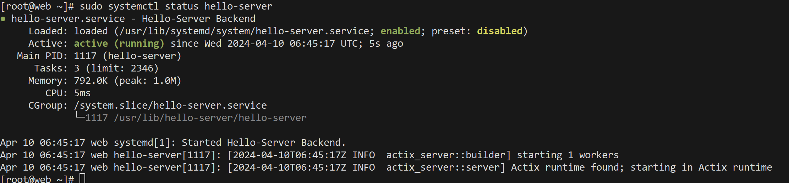

<a id="Part2"></a>

# Assignment 3 Part 2 - ACIT 2420 - Kevin Ding

This tutorial is a continuation of Part 1 for Arch Linux. This tutorial also assumes you are using ```ssh``` to access your server. 

#### This tutorial only works if you completed Part 1 correctly.

### Step 1. Install Necessary Software

Update your system

```
sudo pacman -Syu
```

Install ```ufw```, the firewall software we will be using.  

```
sudo pacman -S ufw
```

### Step 1.5. Stop and disable ```iptables```

Before proceeding, ensure ```iptables``` is not running and disabled (Both IPv4 and IPv6).  
It causes issues with ```ufw``` as noted in the ```ufw``` Arch Linux Wiki section.  

```
sudo systemctl stop iptables
sudo stsyemctl disable iptables
```

### Step 2. Configuring ```ufw``` and creating firewalls

#### ENSURE YOU FOLLOW THESE STEPS OR ELSE YOU COULD LOCK YOURSELF OUT OF YOUR SERVER

Ensure ```ufw``` is inactive before making these changes.  

Use this command to check.  

```
sudo ufw status verbose
```

If it is not inactive, use this command to turn ```ufw``` off.

```
sudo ufw disable
```

#### Now time to configure the firewall for our server

By default, deny all incoming traffic and allow outgoing traffic from the server

```
sudo ufw default deny incoming
sudo ufw default allow outgoing
```

Allow ```ssh``` connections so we can still remote access our servers and rate-limit it which denies connections if there was 6 attempts within 30 seconds.

```
sudo ufw allow ssh
sudo ufw limit ssh
```

Allow ```http``` traffic because we are making a webserver which we will be sending data to the server with ```POST``` requests later. Webserver doesn't support ```https``` so we don't need to allow it. 

```
sudo ufw allow http
```

Enable ```ufw``` to allow the firewalls to be active.

```
sudo ufw enable
```

A prompt will appear saying turning on ```ufw``` may disrupt your ```ssh``` connection.  

Ensure you followed everything in this step before turning ```ufw``` on.  

Check if ```ufw``` is running. 

```
sudo ufw status verbose
```

This is what should be shown. 


Port 22 and 80 should allow trafic from anywhere and the defualt should be deny (incoming) and allow (outgoing)

### Step 3. Upload backend file to server

Open another terminal instance or exit out of your current ```ssh``` session with ```exit```.  

Ensure the ```hello-server``` file is downloaded and in the current working directory of your terminal.

The current working directory is usually in your ```C:\Users\{username}``` directory if you are on Windows when you open Powershell. Otherwise, ensure the file is in the current working directory of your terminal.

Using ```sftp```, we will upload the back to the server.

Use this command in your terminal (Ensure you haven't ssh into your server)

```
sftp
```

Upload the file using this command.
```
put hello-server
```

After uploading, type ```exit``` in your terminal to exit the ```sftp``` session.  

```ssh``` back into your server to continue

The ```hello-server``` file will be in your ```$HOME``` directory.  


### Step 4. Move backend file inside server

We will need to create a place to put the backend binary.  

```
sudo mkdir -p /usr/lib/hello-server
```

```/usr/lib``` is where read-only user applications are stored.  

Move the ```hello-server``` file to the newly created folder.  

```
cd ~
sudo mv hello-server /usr/lib/hello-server/hello-server
```

Ensure that the file has execute permissions with ```chmod```. We only need execute perms for the user which is ```root```.

```
sudo chmod u+x /usr/lib/hello-server/hello-server
```

### Step 5. Creating unit file

We will create a unit file to have this ```hello-server``` running as a background process. We are calling it ```hello-server.service```.

```
sudo vim /usr/lib/systemd/system/hello-server.service
```

This should be in the ```hello-server.service``` file.

```
[Unit]
Description=Hello-Server Backend
After=ufw.service nginx.service
Requires=ufw.service nginx.service

[Service]
ExecStart=/usr/lib/hello-server/hello-server

[Install]
WantedBy=multi-user.target
```

- ```After``` means that this service starts running after ```ufw.service``` and ```nginx.service``` is up and running fully. Without this, all services will start running at the same time.  
- ```Requires``` indicates what are this service dependencies. This service will not start without ```ufw.service``` or ```nginx.service```
- ```Type``` indicates what type of service we are running. We are not running a type ```oneshot``` or ```notify```. No ```type``` needs to be inside the unit file because default is ```simple```.
- ```ExecStart``` tells the service what file to execture on start. This will be our backend file.
- ```WantedBy``` allows us to enable the service, telling it to create/remove a symbolic link in ```/etc/systemd/system/multi-user.target.wants``` which is where the system will look in to find services to start on boot. It create/remove a symbolic link when we enable or disable this service.


Check the status of the ```hello-server.service``` with this command.

```
sudo systemctl status hello-server
```

This should be the status of your ```hello-server.service```



### Step 6. Creating reverse proxy

We will edit our ```nginx-2420.conf``` to add the reverse proxy to allow access to our backend.  

Change directory to ```sites-available```

```
cd /etc/nginx/sites-available
```

Edit the ```nginx-2420.conf``` file we made in Part 1

```
sudo vim nginx-2420.conf
```

This needs to be in your ```nginx-2420.conf``` file now.

```
server {
    listen 80;
    listen [::]:80;

    server_name 164.92.77.120;

    root /web/html/nginx-2420;

    index index.html;

    location /hey {
        proxy_pass http://127.0.0.1:8080;
        proxy_http_version 1.1;
        proxy_set_header Host $host;
        proxy_set_header X-Real-IP $remote_addr;
        proxy_set_header X-Forwarded-For $proxy_add_x_forwarded_for;
        proxy_set_header X-Forwarded-Proto $scheme;
    }

    location /echo {
        proxy_pass http://127.0.0.1:8080;
        proxy_http_version 1.1;
        proxy_set_header Host $host;
        proxy_set_header X-Real-IP $remote_addr;
        proxy_set_header X-Forwarded-For $proxy_add_x_forwarded_for;
        proxy_set_header X-Forwarded-Proto $scheme;
    }
}
```
Remember the server_name will be the IP of your server.

- ```proxy_pass``` indicates the address of a proxied server. In this case, it is ```127.0.0.1:8080```.
- ```proxy_set_header``` allows us to pass headers from the original request to the proxy server.  
We want it to be able to forward headers to the proxy server from the original request.  


We set up a symbolic link already in Part 1 so we only need to restart ```nginx``` to allow changes to take effect.   
```
sudo systemctl restart nginx 
```

### Step 7. Verify the backend/reverse proxy

We can check out the website now to see if the website is running properly now.

We will use ```curl``` to verify if our backend and reverse proxy are running.  

We are using ```PowerShell``` on Windows, install ```curl``` using a package manager such as ```chocolatey```.

Ensure that the IP you type is the IP of your server.  

```164.92.77.120``` is my server's IP

Run this command to see if ```/hey``` is working.

```
curl 164.92.77.120/hey
```

You should get this response.

```
Hey there
```

Image for confirmation


Run this command to see if ```/echo``` is working.

```
curl -X POST -H "Content-Type: application/json" `
  -d '{"message": "Hello from your server"}' `
  http://164.92.77.120/echo
```

You should get this response.

```
{"message": "Hello from your server"}
```

Image for confirmation


### You can also do this in Postman.

Checking ```164.92.77.120/hey```


Checking ```164.92.77.120/echo```.  

Ensure ```Content-Type``` is ```application/json``` for Postman to work in this case.


If you got those two responses from 
```164.92.77.120/hey``` and ```164.92.77.120/echo```, everything is working!!!

You can try out the backend using my server IP ```164.92.77.120``` and the commands in step 7.

