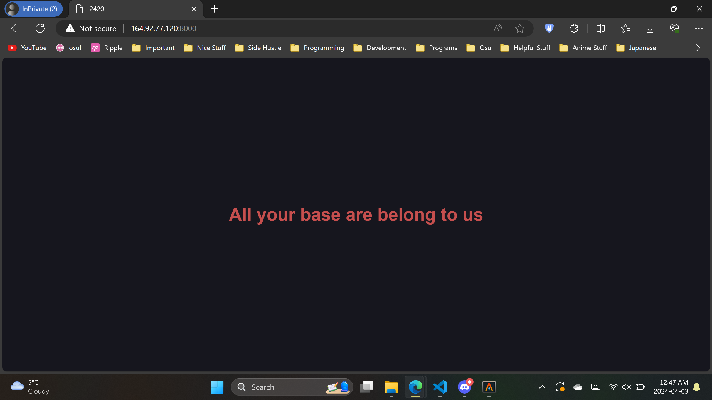
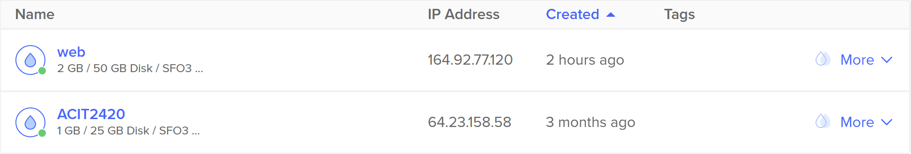

# Assignment 3 Part 1 - ACIT 2420 - Kevin Ding

Ensure you are the root user throughout the process of this tutorial. If you are not the root user by default, use the command ```su``` to switch to the root user. 
```
su

# May prompt you for password
```

This tutorial is meant for fresh installations of Arch Linux with root permissions. Ensure you have the IP address to your server for testing purposes.

### Step 1: Install Necessary Software

You need the following software installed:

- nginx
- Vim or another text editor

nginx is responible for serving content from our server.  
Vim is the text editor of choice to edit files. You can use something else if Vim isn't available.   

Update your system.
```
pacman -Syu
```

Install nginx and Vim
```
pacman -S nginx
```
```
pacman -S vim
```

### Step 2. Start and enable nginx

By default, nginx is turned off. We need to turn on the nginx via ```systemctl```

```
systemctl start nginx
systemctl enable nginx
```
To check if everything is setup correctly use ```systemctl status nginx``` to see the status of nginx.
```
systemctl status nginx
```
```
● nginx.service - A high performance web server and a reverse proxy server
     Loaded: loaded (/usr/lib/systemd/system/nginx.service; enabled; preset: dis
abled)
     Active: active (running) since Wed 2024-04-03 06:17:00 UTC; 10s ago
   Main PID: 8608 (nginx)
      Tasks: 2 (limit: 2303)
     Memory: 2.2M (peak: 2.3M)
        CPU: 33ms
     CGroup: /system.slice/nginx.service
             ├─8608 "nginx: master process /usr/bin/nginx"
             └─8610 "nginx: worker process"
```
The dot should be green to indicate that it is running and enabled should be visible to indicate nginx will start automatically on server startup.

### Step 3. Creating the project directory

We need to create the root folder for nginx to that contains content to serve to users.  
```
mkdir -p /web/html/nginx-2420
```

### Step 4. Creating the index.html
We created the folder now but we haven't created the index.html that the server will provide to users.  
Change directory to ```/web/html/nginx-2420```
```
cd /web/html/nginx-2420
```
Create a new ```index.html``` file inside the current directory.
```
vim index.html
```
Enter the following inside ```index.html```.
```
<!DOCTYPE html>
<html lang="en">
<head>
    <meta charset="UTF-8">
    <meta name="viewport" content="width=device-width, initial-scale=1.0">
    <title>2420</title>
    <style>
        * {
            color: #db4b4b;
            background: #16161e;
        }
        body {
            display: flex;
            align-items: center;
            justify-content: center;
            height: 100vh;
            margin: 0;
        }
        h1 {
            text-align: center;
            font-family: sans-serif;
        }
    </style>
</head>
<body>
    <h1>All your base are belong to us</h1>
</body>
</html>
```

### Step 5. Creating up a new server block
We will be creating a new server block to hold all our configurations. The file.  
We will need to create two directories: ```/etc/nginx/sites-available``` and ```/etc/nginx/sites-enabled```

```
mkdir /etc/nginx/sites-available
mkdir /etc/nginx/sites-enabled
```
```/etc/nginx/sites-available``` is where we will store seperate server blocks in different files and ```/etc/nginx/sites-enabled``` is where ```nginx.conf``` will look for those server blocks.  

Change directory to the ```/etc/nginx/sites-available``` directory.  
```
cd /etc/nginx/sites-available
```
Confirm you are in the right directory with ```pwd```. This command returns the full path of your current directory
```
pwd

# Should return /etc/nginx/sites-available
```
Now create a new .conf file called "nginx-2420.conf" to create our server block.
```
vim nginx-2420.conf
```
Enter the following inside ```nginx-2420.conf```.  
NOTE: ```listen``` can should only use ports not already in use to avoid conflicts.
```
server {
    listen 8000; # Can be any port that isn't used

    server_name localhost; 

    root /web/html/nginx-2420; # The path to our project

    index index.html; # The default index file
}
```
Change directory to ```/etc/nginx``` so we can edit the ```nginx.conf``` file.
```
cd /etc/nginx
vim nginx.conf
```
Inside the ```nginx.conf``` file, add the following to the end of ```http``` block.
```
http {
    ...
    include sites-enabled/*;
}
```
This will enable nginx to see seperate server blocks inside the ```/sites-enabled``` folder.

To enable the site now, simply create a symlink of the ```nginx-2420.conf``` file to ```/sites-enabled```.
```
ln -s /etc/nginx/sites-available/nginx-2420.conf /etc/nginx/sites-enabled/nginx-2420.conf
```
The method with two directories and symbolic links makes it easy to add and remove ```.conf``` when needed.

Restart nginx using ```systemctl``` to allow changes to take place.
```
systemctl restart nginx
```

### Step 7. Check the websites are running.

Using your web browser of choice, enter the IP address of your server into the address bar with the port you assigned to the ```nginx-2420.conf``` file.  

If you followed everything exactly, the port will be 8000. Enter ```Server IP Address:8000``` in your address bar of your web browser.  

Example used ```164.92.77.120:8000```  

The following page served should be this, shown below.


The default nginx page should also be available via ```Server IP Address``` without ```:8000```. 

Example used ```164.92.77.120```


If you can view both sites, you have succefully created the website demo. Congrats!!!


This screenshot below shows the created droplet ```web``` I used for this assignment. IP addresss is ```164.92.77.120```
